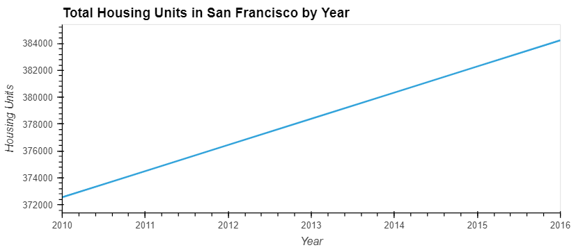
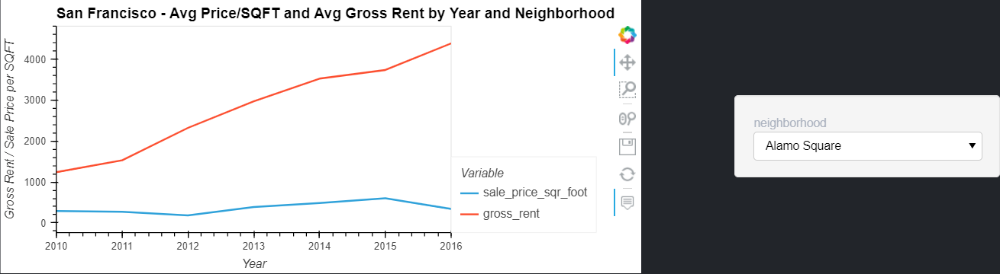
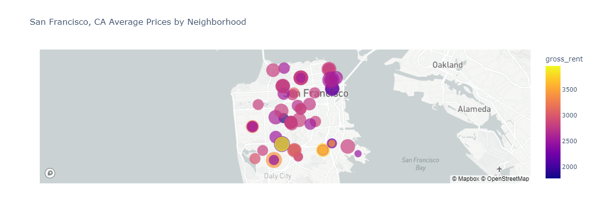

# Housing Rental Analysis: San Francisco

The included Jupyter Notebook may be used to assist locating viable investment opportunities in San Francisco.

## Technologies

Primary tools utilized include `hvPlot`, `Plotly`, and `Mapbox API`.

This Jupyter Lab Notebook has available to it the modules found in: 
> `requirements.txt`

## Installation Guide

The most straightforward method for interacting with the included materials is from within an **anaconda environment**. 
Instructions for installing anaconda may be found [here](https://www.anaconda.com/products/individual).

## Examples

Plot of housing units by year: 

Aggregate pricing info comparison: 

Pricing info by neighborhood: 

Mapbox output: 

## Usage

Once the nessary modules/libraries have been installed, launch Jupyter Lab either via the command line or from within an IDE capable of opening the `.ipynb` file extension. 
From there, all steps performed, accompanying outputs, and analysis can be observed in sequence from top to bottom.

## Contributors

Forrest Surles

## License

MIT License